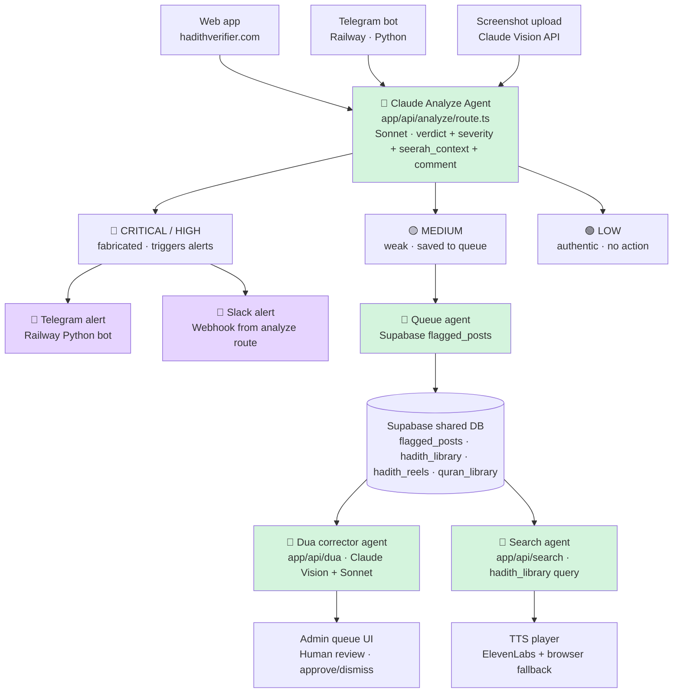
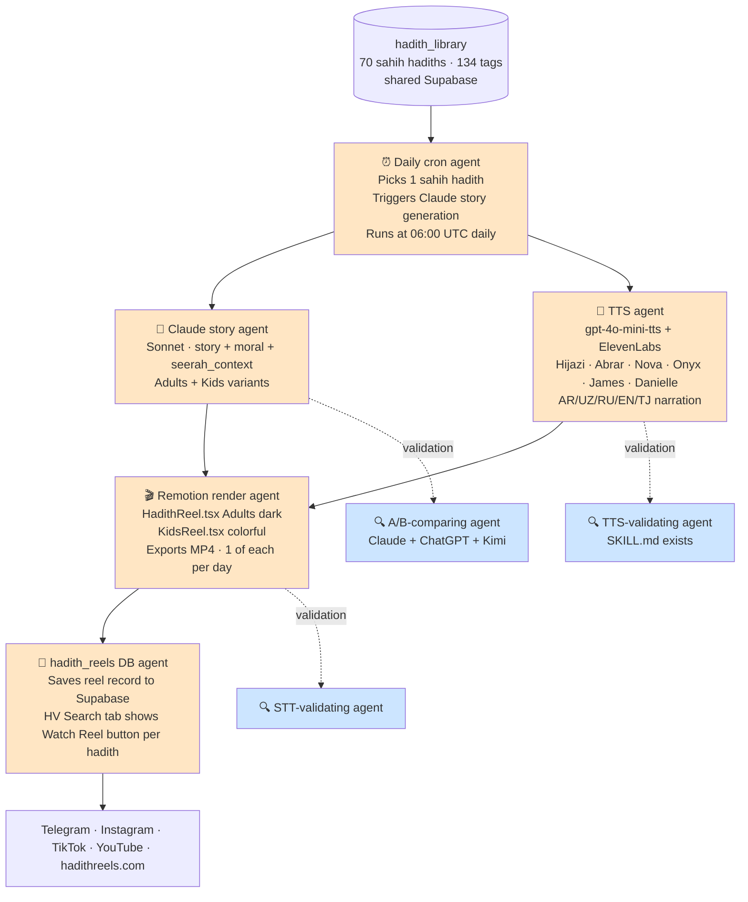
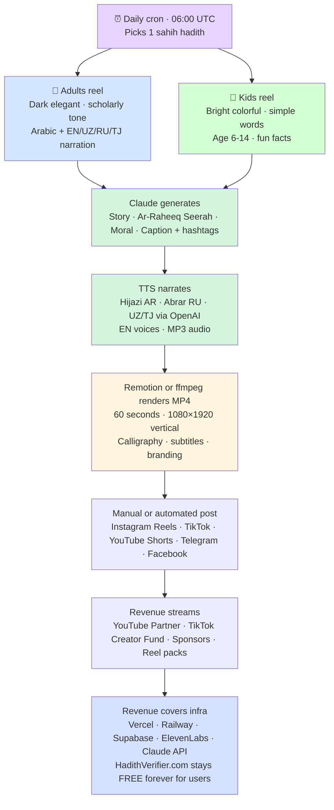
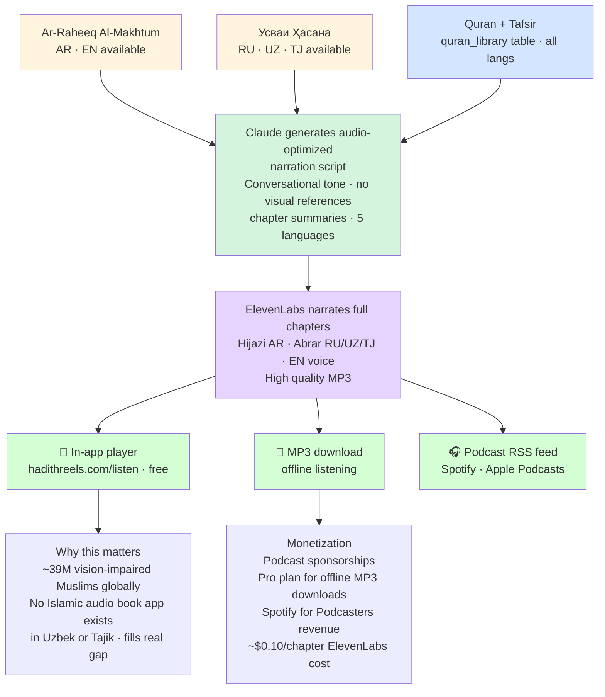
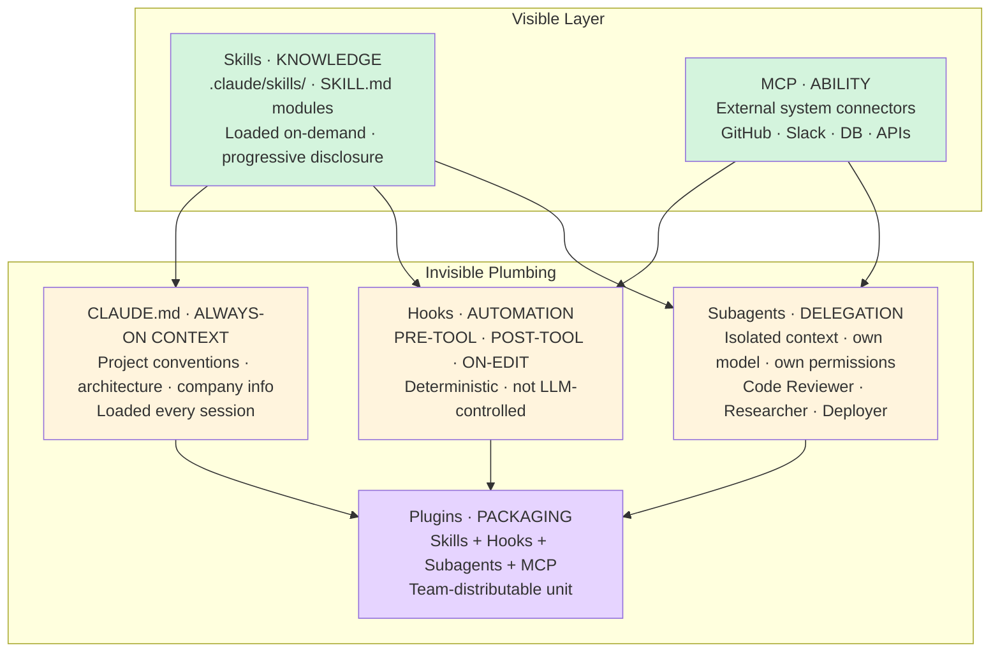

# HV + HR Architecture Diagrams

Source-of-truth diagrams for the Hadith Verifier + Hadith Reels ecosystem.

All diagrams in Mermaid format — text, version-controlled, renders in GitHub/VS Code/Claude.ai natively.

---

## Diagram 1 — HV Full Agent Workflow (currently live)

**Pending HV features (not yet built):**
- ShareCard (P-pending)
- User History
- PWA mode
- Bookmarklet
- Email digest
- ElevenLabs CSP fix on production

---

## Diagram 2 — HR Planned Agent Workflow (post-Hajj 06/06+)

---

## Diagram 3 — HR Content Studio Model

---

## Diagram 4 — HR Audiobook Feature (planned)

---

## Diagram 5 — Six Claude Code Primitives (architectural framing)

**Our mapping (HV+HR project):**

| Primitive | What we have | What we need |
|---|---|---|
| Skills | `agents/tts-validating/SKILL.md` (HR) | Build 10 more skills per agent-fleet-roadmap |
| MCP | Claude Code MCP on Windows | Expose own agents as MCP tools post-Hajj |
| Subagents | None executable | Build orchestrator post-Hajj using Claude Code agent view |
| Hooks | `.githooks/pre-push` (smart pre-push v3) | Commit it; document enable command |
| CLAUDE.md | `CLAUDE.md` + `hr-CLAUDE.md` | Keep updated as architecture evolves |
| Plugins | None | Future · if open-sourcing toolchain |

---

## How to update these diagrams

1. Edit the Mermaid code blocks in this file
2. Preview in VS Code (install "Markdown Preview Mermaid Support" extension), or push to GitHub (renders natively)
3. Verify diagram renders correctly
4. Commit with message describing what changed in the architecture

Do NOT replace diagrams with screenshots — screenshots cannot be diffed, versioned, or edited.

---

## When to update which diagram

| Change | Update diagram |
|---|---|
| New agent added/removed | 1 (HV) or 2 (HR) |
| New data source/sink | 1 or 2 |
| Distribution channel added | 3 |
| New audiobook feature | 4 |
| Claude Code primitive adoption | 5 |
| Sonnet model migration | 1, 2 (update labels) |
